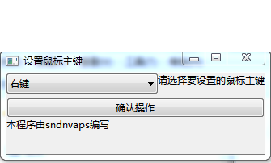

# SwapMouseButton程序是用go 编写的切换鼠标主键的程序

# 实现方法
 调用系统中的user32.dll动态库中的SwapMouseButton函数来实现

# 编译环境
 1. 需要安装go(这是必须要的，不然还怎么编译)
 2. 需要windows系统（交叉编译没有测试过）

# 依赖库
 1. https://github.com/andlabs/ui
 2. http://github.com/josephspurrier/goversioninfo (主要用于生成文件信息)
 
# 如何编译

# 运行效果图

